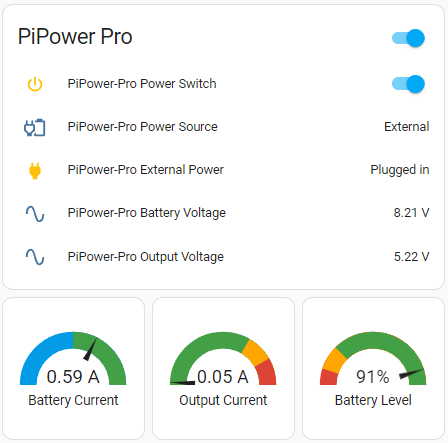
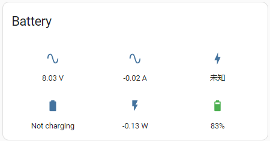
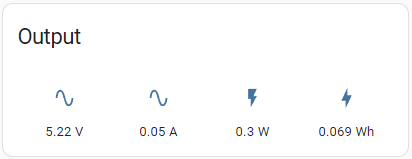
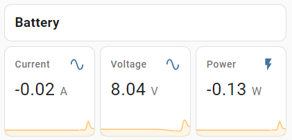
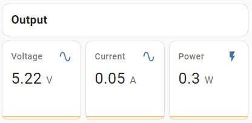
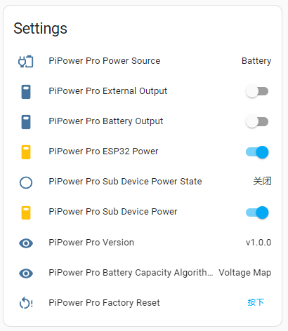

.. _add_card_by_editor:

Add Card by Code Editor 
-----------------------------------

1. After adding any card, you can manually edit the card's yaml file. Click on **SHOW CODE EDITOR** on the card editing page.

    .. image:: img/sp230803_183128.png

2. Then directly modify the yaml file. We provide some useful PiPower Pro configurations. Please copy the following yaml code directly into the box.

    .. image:: img/sp230803_183156.png

    .. image:: img/sp230803_183626.png

**Quick Overview**

.. code-block::

    type: vertical-stack
    cards:
      - type: entities
        entities:
          - entity: switch.pipower_pro_output_switch
          - entity: sensor.pipower_pro_output_source
          - entity: binary_sensor.pipower_pro_external_power
          - entity: sensor.pipower_pro_battery_voltage
          - entity: sensor.pipower_pro_output_voltage
        title: PiPower Pro
        show_header_toggle: true
        state_color: true
      - square: true
        type: grid
        cards:
          - type: gauge
            entity: sensor.pipower_pro_battery_current
            min: -2
            max: 2
            severity:
            green: 0
            yellow: 2
            red: 2
            needle: true
            name: Battery Current
          - type: gauge
            entity: sensor.pipower_pro_output_current
            min: 0
            max: 3
            severity:
            green: 0
            yellow: 2
            red: 2.5
            needle: true
            name: Output Current
          - type: gauge
            entity: sensor.pipower_pro_battery_level
            name: Battery Level
            min: 0
            max: 100
            severity:
            green: 25
            yellow: 10
            red: 0
            needle: true
        columns: 3

**Battery Information**

.. code-block::

    show_name: false
    show_icon: true
    show_state: true
    type: glance
    entities:
      - entity: sensor.pipower_pro_battery_voltage
      - entity: sensor.pipower_pro_battery_current
      - entity: sensor.pipower_pro_battery_capacity
      - entity: binary_sensor.pipower_pro_is_charging
      - entity: sensor.pipower_pro_battery_power
      - entity: sensor.pipower_pro_battery_level
    title: Battery
    columns: 3

**Output Information**

.. code-block::

    show_name: false
    show_icon: true
    show_state: true
    type: glance
    entities:
      - entity: sensor.pipower_pro_output_voltage
      - entity: sensor.pipower_pro_output_current
      - entity: sensor.pipower_pro_output_power
      - entity: sensor.pipower_pro_output_energy
    title: Output

**Battery Chart**

.. code-block::

    type: vertical-stack
    cards:
      - type: markdown
        content: '## Battery'
      - square: true
        columns: 3
        type: grid
        cards:
          - hours_to_show: 12
            graph: line
            type: sensor
            entity: sensor.pipower_pro_battery_current
            detail: 2
            name: Current
          - hours_to_show: 12
            graph: line
            type: sensor
            entity: sensor.pipower_pro_battery_voltage
            detail: 2
            name: Voltage
          - hours_to_show: 12
            graph: line
            type: sensor
            entity: sensor.pipower_pro_battery_power
            detail: 2
            name: Power

**Output Chart**

.. code-block::

    type: vertical-stack
    cards:
      - type: markdown
        content: '## Output'
      - square: true
        columns: 3
        type: grid
        cards:
          - hours_to_show: 12
            graph: line
            type: sensor
            entity: sensor.pipower_pro_output_voltage
            detail: 2
            name: Voltage
          - hours_to_show: 12
            graph: line
            type: sensor
            entity: sensor.pipower_pro_output_current
            detail: 2
            name: Current
          - hours_to_show: 12
            graph: line
            type: sensor
            entity: sensor.pipower_pro_output_power
            detail: 2
            name: Power

**Settings**

.. code-block::

    type: entities
    entities:
      - entity: sensor.pipower_pro_input_voltage
      - entity: sensor.pipower_pro_output_source
      - entity: switch.pipower_pro_external_output
      - entity: switch.pipower_pro_battery_output
      - entity: switch.pipower_pro_esp32_power
      - entity: binary_sensor.pipower_pro_sub_device_power_state
      - entity: switch.pipower_pro_sub_device_power
      - entity: sensor.pipower_pro_version
      - entity: sensor.pipower_pro_battery_capacity_algorithm
      - entity: button.pipower_pro_factory_reset
    title: Settings
    show_header_toggle: false
    state_color: true