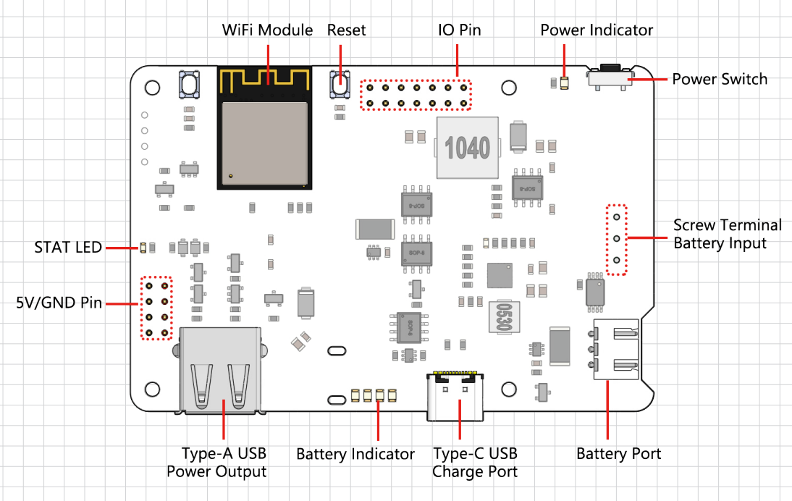
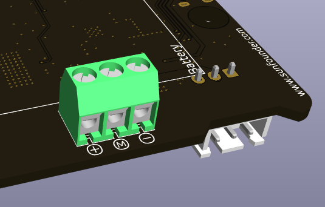
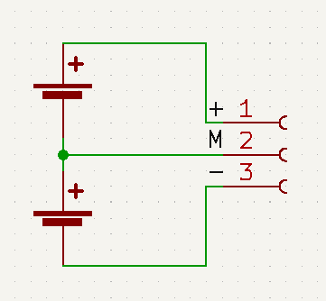
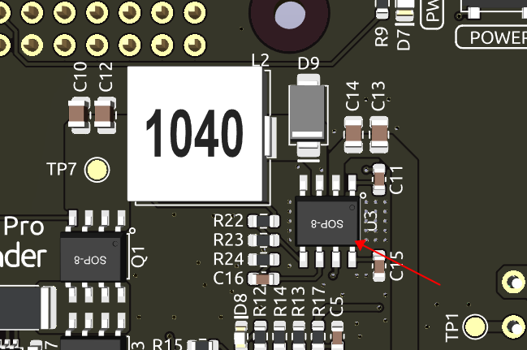

機能一覧
===============

* **パススルー充電**
* **シャットダウン時の電流：< 0.5mA**
* **入力：**

    * USB Type-C, 5V/3A
    * バッテリー入力
* **出力：**

    * USB Type-A, 5V/3A
    * 2x4P P2.54 ピンヘッダー

* **充電電力：5V/2A**
* **搭載バッテリー**

    * タイプ: 3.7V リチウムイオンバッテリー x 2
    * 容量: 2000mAh
    * コネクタ: PH2.0, 3P

* **過放電保護電圧：6.0V**
* **過充電保護電圧：8.4V**
* **サイズ: 90mm x 60mm x 24.9mm**
* **基板上のインジケータ**

    * 1 x 充電インジケータ (CHG)
    * 1 x 電源インジケータ (PWR)
    * 4 x バッテリーインジケータ (D4 ~ D7)

* **基板上の電源スイッチ**
* **基板上のMCU ESP32 S2**

詳細説明
------------------------------------

**STAT LED**

ESP32 S2のステータスを示すインジケータです。

* 消灯: ESP32 S2の電源がオフ。
* ゆっくり点滅: ESP32 S2の電源はオンですが、Wi-Fiは接続されていません。
* 点灯: ESP32 S2の電源がオンで、Wi-Fiが接続されています。

.. note:: 「ESP32 S2がオフ」という状態は、USB Type Cの電源が接続されている状況を指します。この状態では、ESP32 S2は「電源がオフ」という技術的な意味でオフですが、完全にはシャットダウンしていません。電源LEDはESP32 S2の制御下で点灯し、一部の機能が稼働している場合があります。USB Type Cの電源を取り外すと、ESP32 S2は完全にシャットダウンします。

**電源経路の切り替え**

PiPower Proは、最大出力保護を確保するために、自動的に電源経路を切り替える機能を統合しています。

1. 外部電源が接続されている場合、5Vの出力は外部のUSB Type Cを介して直接供給され、スイッチでオフにすることができます。外部の電源は、入力電圧が4.6Vを超えることを確認しながら、最大電流でバッテリーを充電します。
2. 電源が切断される瞬間、システムはシームレスにバッテリー電源への出力に切り替わり、電源の中断中もシステムが正常に動作することを確保します。
3. 外部電源が4.6V未満の場合、システムは外部デバイスの電力喪失を防ぐためにバッテリーバックアップ電源に自動的に切り替わります。

.. list-table:: 出力電源のロジック
    :widths: 25 50 50
    :header-rows: 1

    * - スイッチ
      - 外部電源
      - 出力ステータス
    * - オン
      - 接続中
      - 外部電源
    * - オン
      - 接続解除または4.6V以下の電圧
      - バッテリー電源
    * - オフ
      - 接続中
      - オフ
    * - オフ
      - 接続解除または4.6V以下の電圧
      - オフ

**充電電力**

電源がオンの状態では、入力電圧に基づいて充電電流が自動的に調整されます。

.. list-table:: 充電電流のロジック
    :widths: 25 50
    :header-rows: 1

    * - スイッチ
      - 充電電流
    * - オン
      - 入力電圧に基づいて調整
    * - オフ
      - 2A

1. スイッチが「オフ」の状態の場合、PiPower Proは外部に電源を供給せず、充電電流は最大2Aに達し、迅速に充電することができます。0%から100%までの充電時間は約2時間10分です。
2. 「オン」の状態では、PiPower Proが外部に電源を供給する必要があり、外部のUSBもバッテリーに電源を供給する必要があります。USBの電源供給の電圧が安定していることを確保するために、入力電圧に基づいて充電電流が調整され、電圧が4.6V以上に保たれるようにします。

**過放電保護**

シングルバッテリーの電圧が3V以下になると、バッテリー保護が作動し、バッテリーはこれ以上放電されません。

バッテリーが取り外されると、オンボードの過放電保護回路のメカニズムにより、電圧は低すぎると見なされ、保護回路が作動します。PiPowerにバッテリーを再度接続すると、バッテリーは正常に動作しません。この場合、Type Cケーブルを充電ポートに差し込むことで保護回路をオフにし、バッテリーを通常通り使用できます。

**過充電保護**

バッテリーの合計電圧が8.4Vに達すると、充電は終了します。

**充電バランス**

2つのバッテリーの電圧が等しくない場合、2つのバッテリーの充電電流は自動的に調整され、2つのバッテリーがバランスを取るようになります。

シングルバッテリーが4.2Vを超えると、電圧分配抵抗チャネルが導通し、バッテリーの充電電流が減少または放電されます。

**バッテリー**

この製品には、2つの3.7V 18650リチウムイオンバッテリーがシリーズ接続されており、XH2.54 3Pコネクタを備え、定格容量は2000mAhです。

* 成分: リチウムイオン (Li-ion)
* 容量: 2000mAh、14.8Wh
* 重量: 90.8g
* セル: 2
* コネクタ: XH2.54 3P
* 過充電保護電圧: セルあたり4.2V
* 過放電保護: 3V

**外部バッテリー**

ねじ端子を使用して、自分のバッテリーを接続できます。デバイスは、3.7Vのリチウムイオンまたはリチウムポリマーバッテリー2つのみをサポートしています。バッテリーには保護ボードが付いていることが望ましく、15W以上の出力が確保されることが推奨されます。

.. warning:: 同時に外部バッテリーと付属のバッテリーを接続しないでください！

**温度**

出力電力が最大公称5V/3Aに達すると、DC-DC降圧チップU1の温度は約70-80℃に上昇しますので、火傷を防ぐために触れないよう注意し、通気を確保してください。温度がDC-DCの保護温度75℃に達すると、DC-DCは過熱損傷を防ぐためにシャットダウンします。

**D8 LED**

D8 LEDは、IP2326充電チップによって提供される充電ステータスインジケーターです。当初、このライトは、充電状態とバッテリーの異常を示すために設計されました。しかし、充電出力で電流の流れがあるかどうかのみを検出できます。この出力電流は、DC-DCコンバータを介して5Vを出力するためにルーティングできます。簡単に言えば、入力電力が不足している場合、バッテリーが電源を補うと、LEDは点灯し続け、誤解を招く可能性があります。ただし、LEDはバッテリーが正常に機能しているかどうかを示すことができるため、残されました（バッテリーが挿入されていない場合、LEDが点滅します）。

バッテリーインジケータ
--------------------------

バッテリーインジケータと電圧との関係は以下の通りです:

* 4つのLEDすべて点灯: 電圧 > 7.7V
* 3つのLED点灯: 電圧 > 7.2V
* 2つのLED点灯: 電圧 > 6.7V
* 1つのLED点灯: 電圧 > 6.4V
* 4つのLEDすべて消灯: 電圧 < 6V、この時、バッテリーを充電する必要があります。
