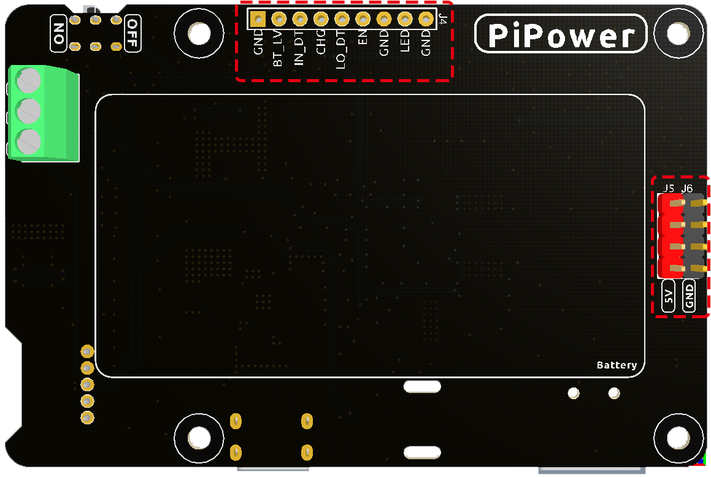

Features
===============

.. image:: img/media2.png

* Pass Through Charging
* Shutdown Current：< 0.5mA
* Input:
    * USB Type-C, 5V/3A
    * Battery Input
* Output：
    * USB Type-A, 5V/3A
    * 2x4P P2.54 pin headers

* Charging Power：5V/2A
* Equipped Battery
    * Type: 3.7V Lithium-ion batteries x 2
    * Capacity: 2000mAh
    * Connector: PH2.0, 3P
* Over Discharge Protection Voltage：6.0V
* Overcharge Protection Voltage：8.4V
* Dimension: 90mm x 60mm x 24.9mm
* On-board Indicators
    * 1 x Charging Indicator (CHG)
    * 1 x Power Indicator (PWR)
    * 4 Battery Indicators (D4 ~ D7)
* On-board Power Switch
* On-board MCU ESP32 S2

.. 详细介绍
.. ------------------------------------

.. **STAT LED**

.. STAT LED是ESP32 S2 的状态指示灯。

.. * 熄灭：ESP32 S2关机*
.. * 慢闪烁：ESP32 S2 开机，Wi-Fi未连接
.. * 常亮：ESP32 S2 开机，Wi-Fi连接

.. .. note:: 所谓的“ESP32 S2关机”状态，在USB Type C输入电源插入的时候，ESP32 S2处于“关机”状态但并没有真的关机。因为电量LED需要ESP32 S2来控制点亮，部分功能也可能会正常使用。但拔掉USB Type C输入电源时，ESP32 S2将彻底关机。

.. **Switch Power Path**

.. PiPower Pro整合电源路径功能，可以自动切换电源路径，最大程度保证输出。

.. 1. 在外接供电时，5V输出由USB Type C外接直接输出，可用开关关断。外接电源在保证输入电压大于4.6V的情况下，以尽可能大的电流给电池充电（详见充电电流）。
.. 2. 拔掉电源瞬间，系统自动切换为电池降压输出供电，无缝切换，保护系统在断电时能正常使用。
.. 3. 外接供电不足4.6V时，自动使用电池补充供电，保证外部设备不会断电。

.. .. list-table:: 输出供电逻辑
..     :widths: 25 50 50
..     :header-rows: 1

..     * - 开关 
..       - 外接电源 
..       - 输出状态
..     * - 打开 
..       - 插入 
..       - 外接供电
..     * - 打开 
..       - 拔出或电压低于4.6V
..       - 电池供电
..     * - 关闭 
..       - 插入 
..       - 关闭
..     * - 关闭 
..       - 拔出或电压低于4.6V
..       - 关闭

.. **Charging Power**

.. 开机状态下充电电流会根据输入电压大小自动调节。

.. .. list-table:: 充电电流逻辑
..     :widths: 25 50
..     :header-rows: 1

..     * - 开关 
..       - 充电电流
..     * - 打开 
..       - 按输入电压调节
..     * - 关闭 
..       - 2A

.. 1. 开关在关闭状态下，PiPower Pro没有对外供电，这时充电电流最大达到2A，快速充电。从0%-100%充电时间约2小时10分钟左右。
.. 2. 在开关打开状态下，由于PiPower Pro需要对外供电，这时外接USB需要同时对外供电，和给电池充电。为了保证USB对外供电的电压，充电电流按照输入电压调节，保证电压不低于4.6V

Detailed Introduction
------------------------------------

**STAT LED**

The STAT LED is the status indicator for the ESP32 S2.

* Off: ESP32 S2 is powered off.
* Slow blinking: ESP32 S2 is powered on, but Wi-Fi is not connected.
* Steady on: ESP32 S2 is powered on and Wi-Fi is connected.

.. note:: The so-called "ESP32 S2 powered off" state refers to the situation when the USB Type C power is connected. In this state, the ESP32 S2 is technically "powered off" but not completely shut down. The power LED still requires the ESP32 S2 to control its illumination, and some functions may remain operational. However, when you unplug the USB Type C power, the ESP32 S2 will shut down completely.

**Switch Power Path**

PiPower Pro integrates a power path function that automatically switches power paths to ensure maximum output protection.

1. When external power is connected, the 5V output is directly supplied through the external USB Type C and can be turned off using the switch. The external power source charges the battery with as much current as possible (see charging current) while ensuring the input voltage is greater than 4.6V.
2. In the moment of power disconnection, the system automatically switches to battery power output with seamless transition, ensuring the system can function properly during power interruptions.
3. If the external power is below 4.6V, the system automatically switches to battery backup power to prevent external devices from losing power.

.. list-table:: Output Power Logic
    :widths: 25 50 50
    :header-rows: 1

    * - Switch 
      - External Power 
      - Output Status
    * - On 
      - Plugged in 
      - External Power
    * - On 
      - Unplugged or voltage below 4.6V
      - Battery Power
    * - Off 
      - Plugged in 
      - Off
    * - Off 
      - Unplugged or voltage below 4.6V
      - Off

**Charging Power**

Under the power-on state, the charging current will automatically adjust based on the input voltage.

.. list-table:: Charging Current Logic
    :widths: 25 50
    :header-rows: 1

    * - Switch 
      - Charging Current
    * - On 
      - Adjusted based on input voltage
    * - Off 
      - 2A

1. When the switch is in the "Off" state, PiPower Pro does not supply power externally, and the charging current reaches a maximum of 2A, allowing for fast charging. The charging time from 0% to 100% is approximately 2 hours and 10 minutes.
2. In the "On" state, since PiPower Pro needs to supply power externally, the external USB also needs to provide power to the battery. To ensure the voltage of the USB power supply remains stable, the charging current is adjusted based on the input voltage, ensuring the voltage stays above 4.6V.

**Over-discharge Protection**

When the single battery voltage is below 3V, the battery protection activates and the battery is no longer discharged.

When the battery is unplugged, due to the mechanism of the on-board over-discharge protection circuit, the voltage will be considered too low, thus activating the protection circuit; when you replug the battery into the PiPower, the battery will not work properly, at this time, you need to plug the Type C cable into the charging port to turn off the protection circuit, and the battery can be used normally.

**Overcharge Protection**

Charging ends when the total battery voltage reaches 8.4V.

**Charge Balance**

When the voltages of the two batteries are not equal, the charging current of the two batteries is automatically adjusted to balance the two batteries.

When a single battery exceeds 4.2V, the voltage divider resistor channel conducts and the battery charging current is reduced or even discharged. 

**Battery**

The product comes with two 3.7V 18650 lithium-ion batteries in series, featuring an XH2.54 3P connector, with a nominal capacity of 2000mAh.

* Composition: Li-ion (Lithium-ion)
* Capacity: 2000mAh, 14.8Wh
* Weight: 90.8g
* Cells: 2
* Connector: XH2.54 3P
* Overcharge Protection Voltage: 4.2V per cell
* Over-discharge Protection: 3V

**External Battery**

.. image:: img/ex_btr0.png

You can connect your own battery using the Screw Terminal. The device only supports two 3.7V lithium-ion or lithium-polymer batteries. It's preferable for the batteries to have a protection board and ensure an output of more than 15W.

.. warning:: Do not connect the external battery and the included battery at the same time!

.. image:: img/ex_btr.png

**Temperature**

When the output power reaches the maximum nominal 5V/3A, the temperature of DC-DC buck chip U1 will rise to about 70-80 degrees Celsius, 
so be careful not to touch it to prevent burns and keep ventilation. When the temperature reaches the DC-DC protection temperature of 75 degrees Celsius, 
the DC-DC will shut down to prevent overheating damage.

.. image:: img/temp_c.png

**D8 LED**

The D8 LED is a charging status indicator provided by the IP2326 charging chip. 
Originally, this light was designed to indicate both the charging status and any abnormalities 
with the battery. However, it can only detect if there's current flow in the charging output. 
This output current can be routed through a DC-DC converter to output 5V. 
In simpler terms, when there's insufficient input power, the battery will supplement the power supply, 
and during this, the LED remains steadily lit, which can be misleading. 
However, the LED was retained as it can indicate if the battery is functioning 
normally (the LED will blink if the battery isn't inserted).

Battery Indicators
--------------------------

The relationship between the battery indicators and voltage is as follows:

* 4 LEDs all on: voltage > 7.7V
* 3 LEDs on: voltage > 7.2V
* 2 LEDs on: voltage >6.7V
* 1 LED on: voltage > 6.4V
* 4 LEDs all off: voltage <6V，at this time，batteries need to be charged.

About IO Pins
-----------------

In order to meet the DIY needs of customers, multiple signal pins are provided on the PiPower, but they are not soldered by default.

* **GND**: Ground input
* **BT_LV**: Get the battery voltage pin. The voltage of this pin is equal to 1/3 of the battery voltage.
* **IN_DT**: Input detect pin. Used to determine if there is USB power input, if so, this pin outputs high.
* **CHG**: Charging status indication pin. This pin is high when charging.
* **LO_DT**: Battery low voltage status pin. In normal state, this pin is low. When low battery voltage is detected, this pin is high.
* **EN:** Switch signal pin. the EN pin can be connected to an external switch, put the pin to ground, the PiPower is off. The external switch can not use self-recovery button or key, etc. The EN pin is only effective when the on-board switch is turned on.
* **GND**: Ground input
* **LED**: Power indicator pin. Output 5V at power on, need to add current limiting resistor in the middle when connect an external LED.
* **GND**: Ground input

About Battery
----------------------

.. .. image:: img/2battery.jpg
..     :width: 300
..     :align: center

* **VCC**: Battery positive terminal, here there are 1 set of VCC and GND is to increase the current and reduce the resistance.
* **Middle**: To balance the voltage between the two cells and thus protect the battery.
* **GND**: Negative battery terminal.

This is a custom battery pack made by SunFounder consisting of two 3.7V 18650 batteries 
with a capacity of 2200mAh. The connector is PH2.0-3P, 
which can be charged directly after being inserted into the PiPower.
