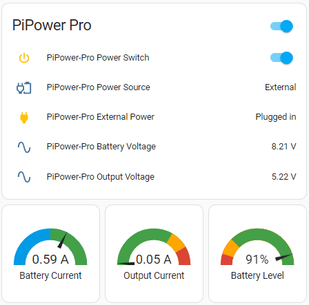
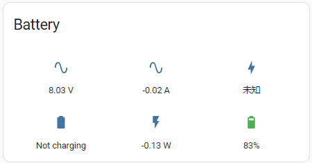
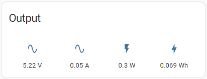
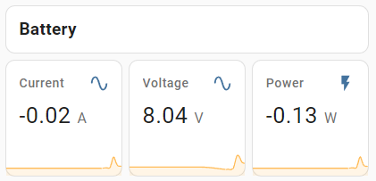
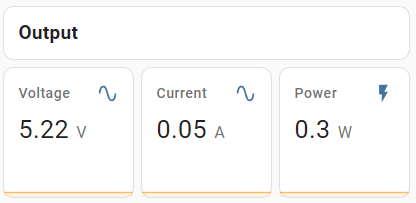
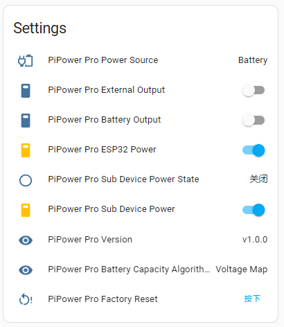

How to use
=======================================

Add PiPower Pro in Home Assistant
---------------------------------

PiPower Pro can be integrated into Home Assistant. 
To do this, you need to have a Raspberry Pi with HassOS installed. 
Please follow the link below for setup. 
If you already have Home Assistant, please ignore.

.. toctree::
    install_hassos

**Step 1**

Install the battery.

**Step 2**

Connect the USB-C charger until all four battery indicators are 
lit (this means the battery is fully charged). 
Press the power button to turn it on.

**Step 3**

Configure the network for PiPower Pro. 
Search for Wi-Fi on your phone (or other device) 
and connect to ``PiPower Pro Fallback Hotspot``. The password is ``123456``.

.. image:: img/pipw_host.jpg

**Step 4**

Once connected, a configuration page will pop up on your phone. Complete the Wi-Fi configuration for PiPower here.

.. image:: img/pipw_wifi.jpg

If the configuration page doesn't automatically pop up, you can open a browser and visit `pipower-pro.local`.

**Step 5**

Open your Home Assistant page, select Configuration from the left sidebar, then select Devices and Services.

.. image:: img/sp230803_162403.png

**Step 6**

Click on ``+ ADD INTEGRATION`` at the bottom right.

.. image:: img/sp230803_162631.png

**Step 7**

Select ``ESPHome``.

**Step 8**

Enter ``pipower-pro.local`` and submit.

**Step 9**

Choose an area for it and complete the setup.

.. image:: img/sp230803_165117.png

**Step 10**

You have now successfully added PiPower Pro. You can add the PiPower Pro configurations you need on the dashboard.

Configure Dashboard
------------------------------

1. On the Home Assistant page, click **Overview** on the left sidebar, which leads you to the control page.

    .. image:: img/sp230803_182537.png

2. Click the menu button, then select **Edit Dashboard**.

    .. image:: img/sp230803_182632.png

3. Click on the bottom right to add a card, select the desired card from the options, configure it as needed, then save.

    .. image:: img/sp230803_182835.png

.. _add_card_by_editor:

Add Card by Code Editor 
-----------------------------------

1. After adding any card, you can manually edit the card's yaml file. Click on **SHOW CODE EDITOR** on the card editing page.

    .. image:: img/sp230803_183128.png

2. Then directly modify the yaml file. We provide some useful PiPower Pro configurations. Please copy the following yaml code directly into the box.

    .. image:: img/sp230803_183156.png

    .. image:: img/sp230803_183626.png

**Quick Overview**

.. code-block::

    type: vertical-stack
    cards:
      - type: entities
        entities:
          - entity: switch.pipower_pro_output_switch
          - entity: sensor.pipower_pro_output_source
          - entity: binary_sensor.pipower_pro_external_power
          - entity: sensor.pipower_pro_battery_voltage
          - entity: sensor.pipower_pro_output_voltage
        title: PiPower Pro
        show_header_toggle: true
        state_color: true
      - square: true
        type: grid
        cards:
          - type: gauge
            entity: sensor.pipower_pro_battery_current
            min: -2
            max: 2
            severity:
            green: 0
            yellow: 2
            red: 2
            needle: true
            name: Battery Current
          - type: gauge
            entity: sensor.pipower_pro_output_current
            min: 0
            max: 3
            severity:
            green: 0
            yellow: 2
            red: 2.5
            needle: true
            name: Output Current
          - type: gauge
            entity: sensor.pipower_pro_battery_level
            name: Battery Level
            min: 0
            max: 100
            severity:
            green: 25
            yellow: 10
            red: 0
            needle: true
        columns: 3

**Battery Information**

.. code-block::

    show_name: false
    show_icon: true
    show_state: true
    type: glance
    entities:
      - entity: sensor.pipower_pro_battery_voltage
      - entity: sensor.pipower_pro_battery_current
      - entity: sensor.pipower_pro_battery_capacity
      - entity: binary_sensor.pipower_pro_is_charging
      - entity: sensor.pipower_pro_battery_power
      - entity: sensor.pipower_pro_battery_level
    title: Battery
    columns: 3

**Output Information**

.. code-block::

    show_name: false
    show_icon: true
    show_state: true
    type: glance
    entities:
      - entity: sensor.pipower_pro_output_voltage
      - entity: sensor.pipower_pro_output_current
      - entity: sensor.pipower_pro_output_power
      - entity: sensor.pipower_pro_output_energy
    title: Output

**Battery Chart**

.. code-block::

    type: vertical-stack
    cards:
      - type: markdown
        content: '## Battery'
      - square: true
        columns: 3
        type: grid
        cards:
          - hours_to_show: 12
            graph: line
            type: sensor
            entity: sensor.pipower_pro_battery_current
            detail: 2
            name: Current
          - hours_to_show: 12
            graph: line
            type: sensor
            entity: sensor.pipower_pro_battery_voltage
            detail: 2
            name: Voltage
          - hours_to_show: 12
            graph: line
            type: sensor
            entity: sensor.pipower_pro_battery_power
            detail: 2
            name: Power

**Output Chart**

.. code-block::

    type: vertical-stack
    cards:
      - type: markdown
        content: '## Output'
      - square: true
        columns: 3
        type: grid
        cards:
          - hours_to_show: 12
            graph: line
            type: sensor
            entity: sensor.pipower_pro_output_voltage
            detail: 2
            name: Voltage
          - hours_to_show: 12
            graph: line
            type: sensor
            entity: sensor.pipower_pro_output_current
            detail: 2
            name: Current
          - hours_to_show: 12
            graph: line
            type: sensor
            entity: sensor.pipower_pro_output_power
            detail: 2
            name: Power

**Settings**

.. code-block::

    type: entities
    entities:
      - entity: sensor.pipower_pro_input_voltage
      - entity: sensor.pipower_pro_output_source
      - entity: switch.pipower_pro_external_output
      - entity: switch.pipower_pro_battery_output
      - entity: switch.pipower_pro_esp32_power
      - entity: binary_sensor.pipower_pro_sub_device_power_state
      - entity: switch.pipower_pro_sub_device_power
      - entity: sensor.pipower_pro_version
      - entity: sensor.pipower_pro_battery_capacity_algorithm
      - entity: button.pipower_pro_factory_reset
    title: Settings
    show_header_toggle: false
    state_color: true

.. _entity:

PiPower Pro Entity
--------------------------

If you are familiar with Home Assistant and want to customize the Card yourself, 
here is a list of PiPower Pro entities you can use.

**Basic Information**
    * binary_sensor.pipower_pro_battery_low - Battery low status (bool)
    * binary_sensor.pipower_pro_is_charging - Charging status (V)

**Switches**
    * switch.pipower_pro_battery_output - Battery output switch (bool)
    * switch.pipower_pro_esp32_power - ESP32 power switch (bool)
    * switch.pipower_pro_external_output - External output switch (bool)

**Output**
    * sensor.pipower_pro_output_voltage - Output voltage (V)
    * sensor.pipower_pro_output_current - Output current (A)
    * sensor.pipower_pro_output_power - Output power (W)
    * sensor.pipower_pro_output_energy - Output energy (Wh) used for calculating total output energy, can be reset via services, see all services for details

**Battery**
    * sensor.pipower_pro_battery_voltage - Battery voltage (V)
    * sensor.pipower_pro_battery_current - Battery current, positive for charging, negative for discharging (A)
    * sensor.pipower_pro_battery_power - Battery output power (W)
    * sensor.pipower_pro_battery_capacity - Battery capacity (mAh)
    * sensor.pipower_pro_battery_level - Battery level (%)

**Input**
    * sensor.pipower_pro_input_voltage - External input voltage (V)

**Sub-device Control**
    * switch.pipower_pro_sub_device_power - Sub-device power control signal (bool)
    * binary_sensor.pipower_pro_sub_device_power_state - Sub-device power state (bool)

**Others**
    * sensor.pipower_pro_battery_capacity_algorithm - Battery capacity algorithm (String)
    * sensor.pipower_pro_power_source - Current output source: Battery/External (String)
    * sensor.pipower_pro_battery_factory_capacity - Battery factory nominal capacity (mAh)
    * binary_sensor.pipower_pro_external_power - External input status (bool)
    * button.pipower_pro_factory_reset - Factory reset button (bool)
    * update.pipower_pro_firmware - Update firmware
    * switch.pipower_pro_power_switch - Output switch (bool)
    * sensor.pipower_pro_version - PiPower Pro version (String)

**All Services**
    * set_battery_factory_capacity - Modify battery factory nominal capacity (capacity: int, mAh), default 2000
    * enable_coulomb_count_beta - Enable Coulomb counting algorithm (enable: bool), default false
    * reset_capacity - Reset current capacity to factory nominal capacity
    * reset_output_energy - Reset output energy to 0
    * set_edv2 - Set End of Discharge Voltage 2, voltage for end-of-discharge calibration 2, default 6.8. See Coulomb count for details
    * set_edv1 - Set End of Discharge Voltage 1, voltage for end-of-discharge calibration 1, default 6.5. See Coulomb count for details
    * set_edv0 - Set End of Discharge Voltage 0, voltage for end-of-discharge calibration 0, default 6.2. See Coulomb count for details
    * set_rcv - Set Reset Calibrate Voltage, voltage for reset calibration status, default 8.0. See Coulomb count for details
    * simulate_low_power - Simulate low power for testing low power trigger scenarios

