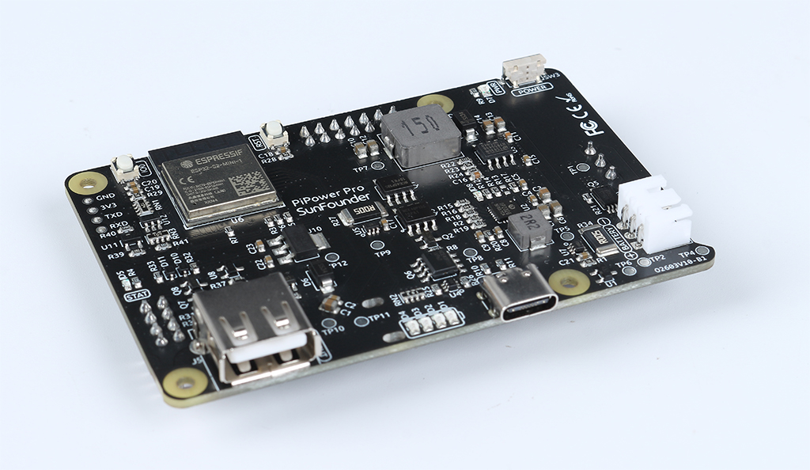

PiPower - Raspberry Pi用のUPSおよびバッテリー
=============================================

SunFounder PiPowerをお選びいただき、ありがとうございます。

.. note::
    このドキュメントは以下の言語で利用可能です。

        * |link_german_tutorials|
        * |link_jp_tutorials|
        * |link_en_tutorials|

    ご希望の言語でドキュメントにアクセスするために、それぞれのリンクをクリックしてください。

**UPSとは何か？**

Raspberry Piのプロジェクトが常時電源を必要とする場合、主電源のみに依存するのは適切ではありません。地域によっては、頻繁に電源が落ちたり、サージが発生したりすることがあります。電源の変動はRaspberry Piを破損させる可能性があり、電源が途絶えると、Raspberry Piはすぐにシャットダウンします。したがって、安全にシャットダウンすることができず、SDカード上の全てのデータが失われるリスクが高まり、破壊される可能性が増加します。

そのため、無停電電源装置（UPS）の使用が推奨されます。

UPSを使用すると、メイン電源からの電源遮断が発生した場合（遮断＝停電）、バッテリーや他の電源が引き継いでデバイスに電力を供給し続け、シャットダウンすることなく動作します。UPSは、非常電源として考えることが多いです。主電源が復旧した後、UPSは再充電され、次のトラブルに備えることができます。

**PiPowerについて**

これが、最初にPiPowerを設計した理由です。PiPowerは、Raspberry Piの第二の電源として使用できます。PiPowerにUSB-Cメイン電源アダプタを接続すると、Raspberry Piに直接電力を供給し、バッテリーを低電流で充電します。停電やUSB-Cメイン電源の切断が発生した場合、PiPowerはRaspberry Piをシームレスに電源供給できます。

PiPowerは、5V/3Aの電源供給を出力でき、様々なRaspberry Piの使用状況に対応しています。
4つの電源インジケータがあり、各インジケータは電源の25%を示し、Raspberry Piの電源を入/切するスイッチも装備しています。

.. warning::
    バッテリーを初めて入れるときや、バッテリーを取り外して再度入れるときには、正常に動作しない場合があります。このような場合、Type Cケーブルを充電ポートに差し込んで、保護回路をオフにする必要があります。その後、バッテリーは正常に使用できます。

**PiPower Proについて** 

PiPower Proは、PiPowerを基盤に、ESP32 S2モジュールを統合してモジュールのバッテリー電圧や電流状態、入出力電圧、電流をリアルタイムで監視できるようにしました。また、充電電流のインテリジェントな調整や、入力電源とバッテリー電源の間でのシームレスな切り替えを特長としており、連続した電源出力が確保されます。

Home Assistantと統合することで、ユーザーはすべてのパラメータデータに簡単にアクセスし、スマートデバイスのシナリオの自動化を設定できます。

さらに、PiPower Proは、サブデバイスのオン/オフ状態を制御するための外部IOインターフェースを提供しています。オープンソースのESPHome設定を利用して、ユーザーはIO機能をカスタマイズし、さらに多くのセンサーをシステムに追加することができます。

製品を使用中に何か質問があれば、service@sunfounder.comまでメールをお送りください。できるだけ早くご返信いたします。

.. toctree::
    PiPower Proについて <self>
    components
    assemble
    features
    start
    faq

