Install the HassOS
--------------------------

This section will guide you in installing the Home Assistant operating system on your Raspberry Pi. 
Please note that this process will result in the loss of all existing content on your Raspberry Pi system. 
It is important to backup your data before proceeding.

**Step 1**

Raspberry Pi have developed a graphical SD card writing tool that works
on Mac OS, Ubuntu 18.04 and Windows, and is the easiest option for most
users as it will download the image and install it automatically to the
SD card.

Visit the download page: https://www.raspberrypi.org/software/. Click on
the link for the **Raspberry Pi Imager** that matches your operating system,
when the download finishes, click it to launch the installer.

.. image:: img/image11.png
    :align: center

**Step 2**

When you launch the installer, your operating system may try to block
you from running it. For example, on Windows I receive the following
message:

If this pops up, click on **More info** and then **Run anyway**, then
follow the instructions to install the Raspberry Pi Imager.

.. image:: img/image12.png
    :align: center

**Step 3**

Insert your SD card into the computer or laptop SD card slot.

**Step 4**

In the Raspberry Pi Imager, select the OS that you want to install and
the SD card you would like to install it on.

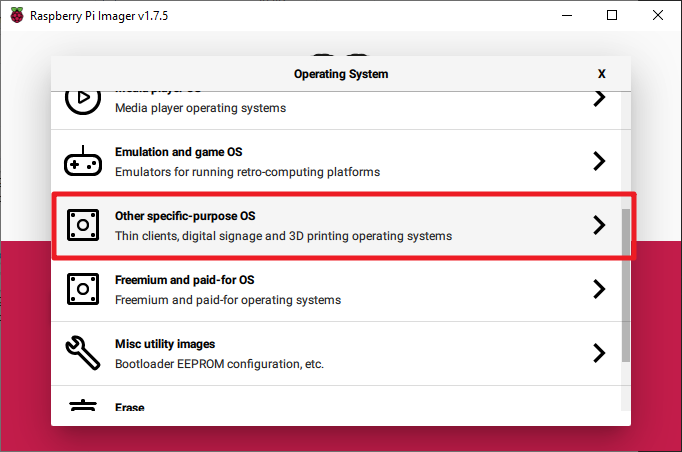

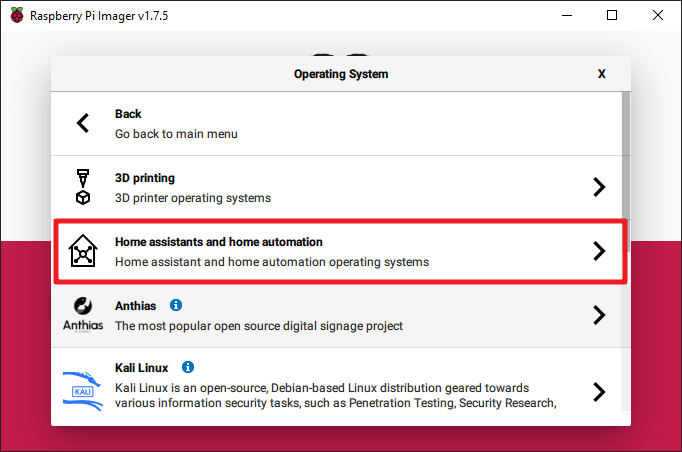

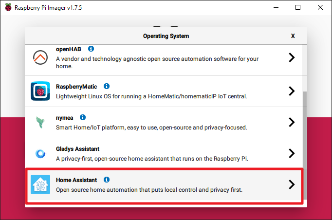

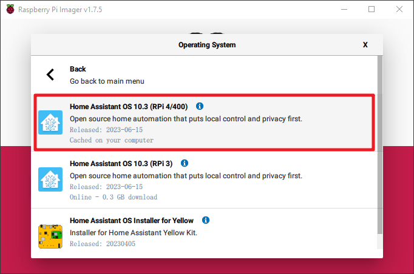

**Step 5**

Select the SD card you are using.

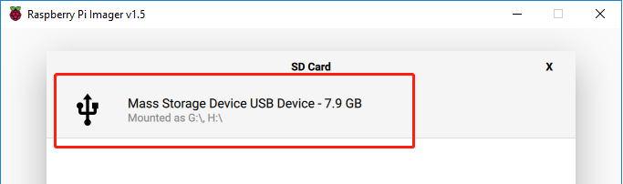

**Step 7**

Click the **WRITE** button.

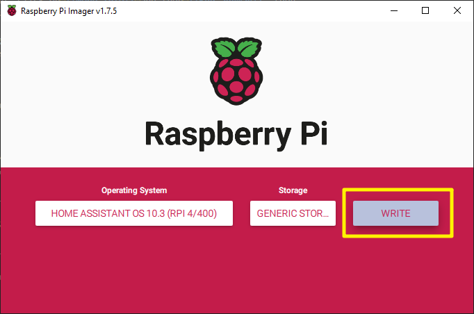

**Step 8**

If your SD card currently has any files on it, you may wish to back up
these files first to prevent you from permanently losing them. If there
is no file to be backed up, click **Yes**.

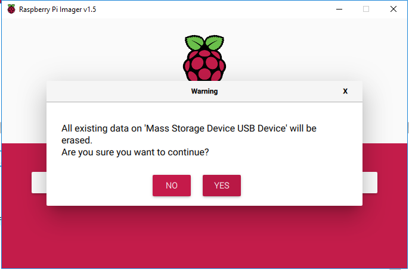

**Step 9**

After waiting for a period of time, the following window will appear to
represent the completion of writing.

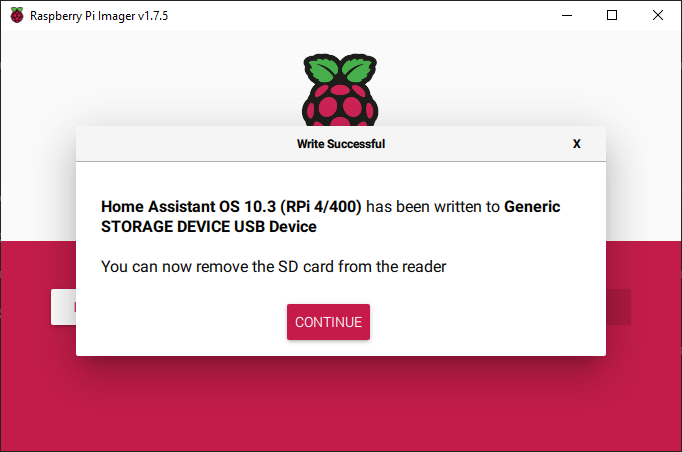

**Step 10**

Next, we will configure WiFi for Pironman.

.. note:: If you intend to use a wired connection for network access, you can skip this step.

Open File Explorer and access the SD card named ``Hassio-boot``

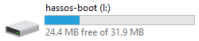

Create a new folder named ``CONFIG`` in the root partition.

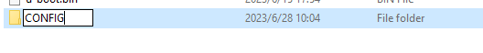

Create a folder named ``network`` inside the ``CONFIG`` folder.

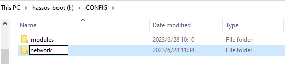

Inside the ``network`` folder, create a new text file named ``my-network`` (without extension).

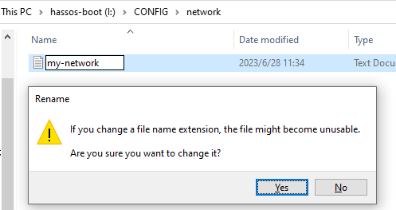

In the ``my-network`` file, write the following text, replacing ``MY_SSID`` and ``MY_WLAN_SECRET_KEY`` with your own network's SSID and password:

.. code-block::

    [connection]
    id=my-network
    uuid=72111c67-4a5d-4d5c-925e-f8ee26efb3c3
    type=802-11-wireless

    [802-11-wireless]
    mode=infrastructure
    ssid=MY_SSID
    # Uncomment below if your SSID is not broadcasted
    #hidden=true

    [802-11-wireless-security]
    auth-alg=open
    key-mgmt=wpa-psk
    psk=MY_WLAN_SECRET_KEY

    [ipv4]
    method=auto

    [ipv6]
    addr-gen-mode=stable-privacy
    method=auto

Save and exit the file.

**Step 11**

Remove the microSD card from your computer and insert it into the Raspberry Pi. Then, connect the power (and Ethernet cable if needed).

Go back to your computer and navigate to ``homeassistant.local:8123`` , 
or if that doesn't work, you can find the IP address by checking your router.

During the first use of Home Assistant, you may need to wait for some time as it performs initial setup.

**Step 12**

Next, you will be prompted to create the first account.

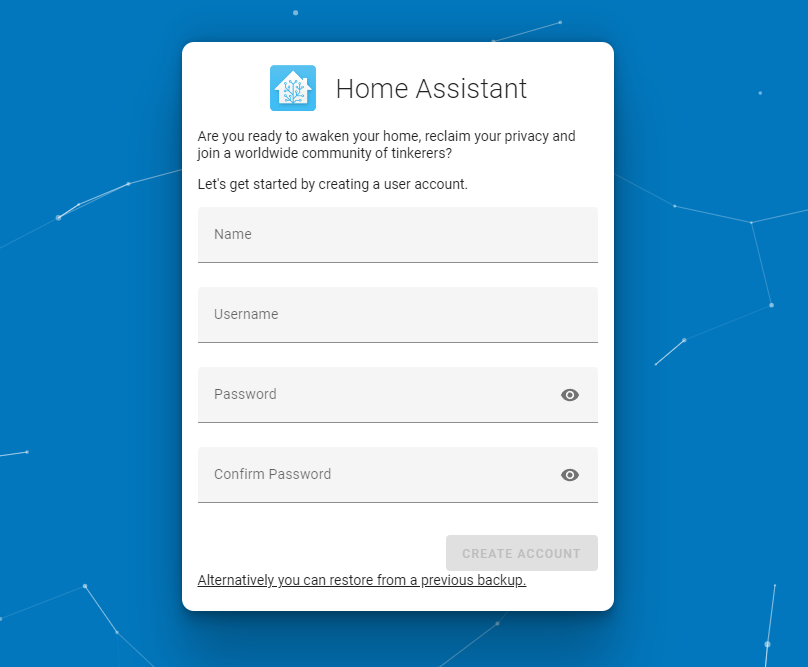

The system will prompt you to install some detected devices, but for now, you can skip this by clicking FINISH.

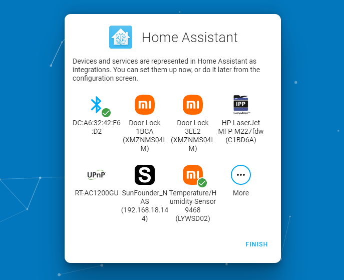

Now you've set up Home Assistant.

