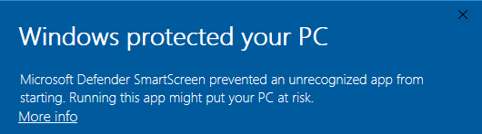

HassOSのインストール
--------------------------

このセクションでは、Raspberry PiにHome Assistantオペレーティングシステムをインストールする手順を案内します。
Raspberry Piのシステムにある既存の内容がすべて失われることに注意してください。
手順を進める前にデータのバックアップが重要です。

**ステップ1**

Raspberry Piは、Mac OS、Ubuntu 18.04、およびWindowsで動作するグラフィカルなSDカードライティングツールを開発しています。これは、イメージをダウンロードしてSDカードに自動でインストールするため、多くのユーザーにとって最も簡単な選択です。

ダウンロードページ https://www.raspberrypi.org/software/ にアクセスします。ご利用のオペレーティングシステムに対応する **Raspberry Pi Imager** のリンクをクリックし、ダウンロードが完了したらインストーラーを起動します。

.. image:: img/image11.png
    :align: center

**ステップ2**

インストーラーを起動すると、オペレーティングシステムが実行をブロックしようとする場合があります。例として、Windowsでは次のようなメッセージが表示される場合があります。

このポップアップが表示された場合、 **More info** をクリックしてから **Run anyway** をクリックし、Raspberry Pi Imagerのインストール手順に従います。

.. raw:: html
    
     

**ステップ3**

SDカードをコンピューターやラップトップのSDカードスロットに挿入します。

**ステップ4**

Raspberry Pi Imagerで、インストールしたいOSとインストールするSDカードを選択します。

.. image:: img/sp230627_181014.png

.. image:: img/sp230627_181112.png

**ステップ5**

使用するSDカードを選択します。

.. image:: img/image14.png
    :align: center

.. raw:: html
    
     

**ステップ6**

**WRITE** ボタンをクリックします。

.. image:: img/sp230627_181444.png

**ステップ7**

SDカードにファイルがある場合は、それらのファイルをバックアップして永久に失うことを防ぎます。バックアップするファイルがない場合は、 **Yes** をクリックします。

.. image:: img/image18.png
    :align: center

**ステップ8**

しばらく待った後、書き込みが完了したことを示すウィンドウが表示されます。

.. raw:: html
    
     

**ステップ9**

次に、PironmanのWiFiを設定します。

.. note:: 有線接続を使用してネットワークにアクセスする予定の場合、このステップはスキップできます。

ファイルエクスプローラーを開き、 ``Hassio-boot`` という名前のSDカードにアクセスします。

.. image:: img/sp230628_095957.png

ルートパーティションに ``CONFIG`` という新しいフォルダを作成します。

``CONFIG`` フォルダ内に ``network`` というフォルダを作成します。

.. image:: img/sp230628_113426.png

``network`` フォルダ内に、拡張子なしで ``my-network`` という新しいテキストファイルを作成します。

.. image:: img/sp230628_113506.png

``my-network`` ファイルに次のテキストを書き込み、 ``MY_SSID`` と ``MY_WLAN_SECRET_KEY`` をご自身のネットワークのSSIDとパスワードに置き換えます：

.. code-block::

    [connection]
    id=my-network
    uuid=72111c67-4a5d-4d5c-925e-f8ee26efb3c3
    type=802-11-wireless

    [802-11-wireless]
    mode=infrastructure
    ssid=MY_SSID
    # Uncomment below if your SSID is not broadcasted
    #hidden=true

    [802-11-wireless-security]
    auth-alg=open
    key-mgmt=wpa-psk
    psk=MY_WLAN_SECRET_KEY

    [ipv4]
    method=auto

    [ipv6]
    addr-gen-mode=stable-privacy
    method=auto

ファイルを保存して閉じます。

**ステップ10**

microSDカードをコンピュータから取り出し、Raspberry Piに挿入します。その後、電源（および必要な場合はイーサネットケーブル）を接続します。

コンピュータに戻って ``homeassistant.local:8123`` に移動します。
それが機能しない場合は、ルーターでIPアドレスを確認できます。

Home Assistantを初めて使用する際、初期設定を実行するためにしばらく待つ必要がある場合があります。

.. image:: img/sp230628_141749.png

**ステップ11**

次に、最初のアカウントの作成を促されます。

.. image:: img/sp230627_135949.png

システムは、検出されたデバイスのインストールを促しますが、今のところ、FINISHをクリックしてこれをスキップできます。

.. image:: img/sp230627_141016.png

これで、Home Assistantのセットアップが完了しました。

