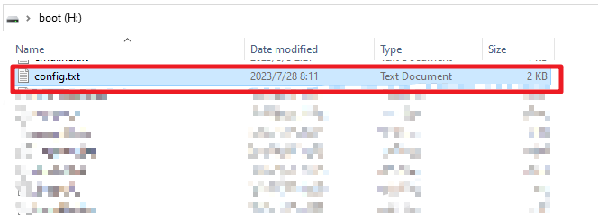
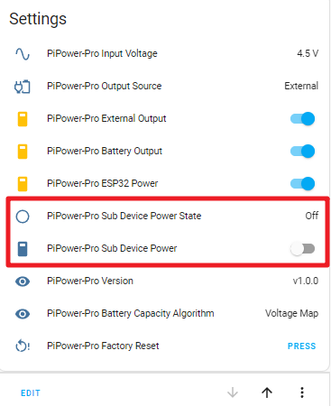

Setting up Safe Shutdown
---------------------------------

PiPower Pro has two pins that are pre-configured to 
monitor the power status (referred to as sub-devices below) of connected devices, 
enabling remote power on, power off, 
and automatic safe shutdown when the battery is low.

.. note:: If the host running HassOS is set as a sub-device of PiPower Pro, it will also lose its functionality when the host shuts down, and remote power-on will not be possible.

* Pin 42 and sensor entity ``binary_sensor.pipower_pro_sub_device_power_state`` read the current state of the device.
* Pin 41 and entity ``switch.pipower_pro_sub_device_power`` control the sub-device power.

For example, let's use PiPower Pro as a UPS power source for a Raspberry Pi, 
monitoring its status and automatically shutting it 
down safely when external power is lost and the battery level is low.

**Step 1**

Configure the Raspberry Pi. 

Set the two Raspberry Pi pins 
to the **Power Status Signal Pin** 
and **Shutdown Signal Pin** respectively. 
This can be done through devicetree.

Insert the SD card with the Raspberry Pi system into your computer. 
In the root directory of the boot partition, find ``config.txt``.

Open it and add the following two lines at the end under ``[all]``.

.. code-block::

    dtoverlay=gpio-poweroff,gpiopin=17
    dtoverlay=gpio-shutdown,gpio_pin=18

* ``gpio-poweroff`` is the Raspberry Pi's power on/off status. After successful configuration, the Raspberry Pi will set this pin high when powered on and pull it low when powered off.
* ``gpio-shutdown`` controls the signal for shutting down the Raspberry Pi. After successful configuration, pulling this pin low will trigger the Raspberry Pi to shut down.

**Step 2**

* Connect PiPower Pro's pin 42 to the Raspberry Pi's ``gpio-poweroff`` pin, here using pin 17.
* Connect PiPower Pro's pin 41 to the Raspberry Pi's ``gpio-shutdown`` pin, here using pin 18.

**Step 3**

Now test if the above two signals are working properly.

Add two entities to the Dashboard: 

* ``binary_sensor.pipower_pro_sub_device_power_state``
* ``switch.pipower_pro_sub_device_power``

If you add the **Settings** Card (see :ref:`add_card_by_editor` for instructions on adding cards), these two entities will be included, labeled as ``PiPower-Pro Sub Device Power State`` and ``PiPower-Pro Sub Device Power``.

You can use the former to check if the Raspberry Pi is working and 
the latter to power off the Raspberry Pi.

.. note:: ``PiPower-Pro Sub Device Power`` can only power off the Raspberry Pi. To power it on, you still need to supply power to the Raspberry Pi (i.e., turn on the main switch on the **PiPower Pro** Card).

**Step 4**

Next, configure automations to enable PiPower Pro to safely shut down the Raspberry Pi:

1. Open the Home Assistant configuration page, click on "Settings" on the left sidebar, and choose "Automations."

    .. image:: img/sp230804_170032.png

2. Create a new automation.

    .. image:: img/sp230804_170118.png

    .. image:: img/sp230804_170148.png

#. Click "Edit in YAML."

    .. image:: img/sp230804_170218.png

#. Replace the existing code with the following code.

    .. code-block::

        alias: Safe shutdown RPi
        description: Turn off Raspberry Pi if no external power plug in and battery low
        trigger:
          - platform: state
            entity_id:
              - binary_sensor.pipower_pro_external_power
            from: "on"
            to: "off"
          - platform: numeric_state
            entity_id: sensor.pipower_pro_a03846_battery_level
            below: 25
        condition:
          - condition: and
            conditions:
              - condition: state
                entity_id: binary_sensor.pipower_pro_a03846_external_power
                state: "off"
          - condition: and
            conditions:
              - condition: state
                entity_id: switch.pipower_pro_sub_device_power
                state: "on"
        action:
          - type: turn_off
            device_id: a0ee4e356c85c4f69f765ed72baad129
            entity_id: switch.pipower_pro_sub_device_power
            domain: switch
        mode: single

#. Click "Save."

    .. image:: img/sp230804_170504.png

#. Click "rename."

    .. image:: img/sp230804_170527.png

#. Go back one level. Now you should see the newly set automation.

    .. image:: img/sp230804_170710.png

.. note:: We need to create a few more automations. Refer to the previous steps to complete them all.

**Save Power**

.. code-block::

    alias: Save Power
    description: Turn off if raspberry pi power off
    trigger:
      - platform: state
        entity_id:
          - binary_sensor.pipower_pro_sub_device_power_state
        from: "on"
        to: "off"
    condition:
      - condition: state
        entity_id: switch.pipower_pro_sub_device_power
        state: "off"
    action:
      - delay:
        hours: 0
        minutes: 0
        seconds: 2
        milliseconds: 0
      - type: turn_off
        device_id: a0ee4e356c85c4f69f765ed72baad129
        entity_id: switch.pipower_pro_a03846_power_switch
        domain: switch
      - type: turn_off
        device_id: a0ee4e356c85c4f69f765ed72baad129
        entity_id: switch.pipower_pro_a03846_esp32_power
        domain: switch
    mode: single

**Sync Power Off RPi**

.. code-block::

    alias: Sync Power Off RPi
    description: Power Off Raspberry Pi is Switch Off
    trigger:
      - platform: state
        entity_id:
          - switch.pipower_pro_a03846_power_switch
        from: "on"
        to: "off"
    condition: []
    action:
      - type: turn_off
        device_id: a0ee4e356c85c4f69f765ed72baad129
        entity_id: switch.pipower_pro_sub_device_power
        domain: switch
    mode: single

**Sync Power On RPi**

.. code-block::

    alias: Sync Power On RPi
    description: Power On Raspberry Pi is Switch On
    trigger:
      - platform: state
        entity_id:
          - switch.pipower_pro_a03846_power_switch
        from: "off"
        to: "on"
    condition: []
    action:
      - type: turn_on
        device_id: a0ee4e356c85c4f69f765ed72baad129
        entity_id: switch.pipower_pro_sub_device_power
        domain: switch
    mode: single

**Step 5**

We use a simulated low-power state to trigger the test:

1. Open the SERVICES interface in Developer Tools.

    .. image:: img/sp230804_171500.png

2. Find ``ESPHome: pipower_pro_simulate_low_power``, enable it, and click the "Call Service" button.

    .. image:: img/sp230804_171721.png

You will see the PiPower battery light go off, 
and the battery level drop to 10% in the overview.

The Raspberry Pi will then shut down, 
and 2 seconds after it completes the shutdown, 
the PiPower Pro will power off, and the PWR light will go off.
